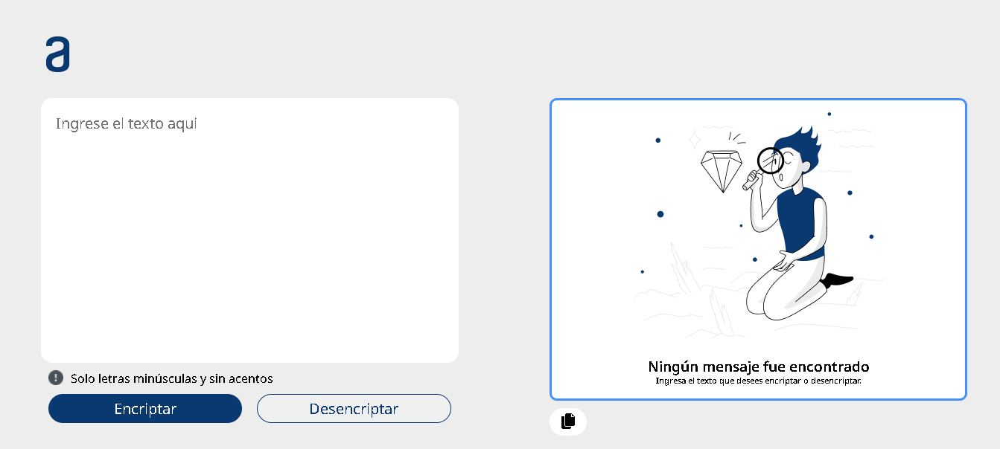

<h1>Encript</h1>
Encript is a simple web application that allows users to encrypt and decrypt text using a custom substitution cipher. 
It was created as a fun project to practice JavaScript programming and web development skills.

<h2>Usage</h2>
The application includes two buttons: "Encrypt" and "Decrypt". 
To encrypt a message, simply enter the text you want to encrypt in the input field and click the "Encrypt" button. 
The app will apply the custom encryption algorithm to your message and display the encrypted text on the screen.
To decrypt a message, enter the encrypted text in the input field and click the "Decrypt" button. 
The app will reverse the encryption process and display the original text on the screen.
You can also copy the encrypted or decrypted text to your clipboard by clicking the "Copy" button.

<h2>Features</h2>
Encript offers the following features:
<li>Encryption and decryption of text using a custom substitution cipher</li>
<li>Simple, user-friendly interface</li>
<li>Copy output text to clipboard with a single click</li>
<li>Input validation to prevent invalid characters and texts that are too long</li>

<h2>View</h2>

<h2>Contributing</h2>
If you'd like to contribute to the Encript project, feel free to submit a pull request with your changes. 
Please ensure that your code follows the project's coding standards and includes appropriate documentation.

  
<strong>Note:</strong><em> If the input text is too long, the encrypted text may not be fully displayed on the screen. 
In this case, please use the "Copy" button to copy the encrypted text to your clipboard.</em>
